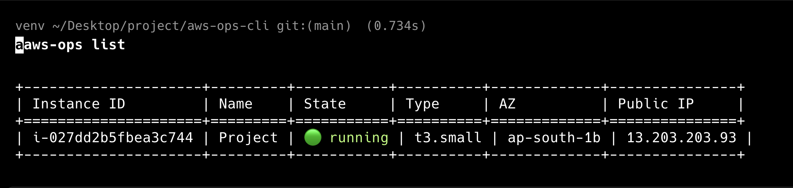
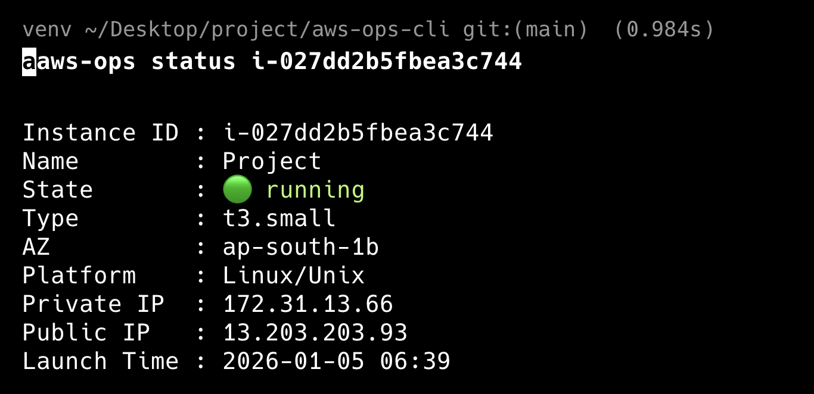

<div align="center">

# ⚡ AWS Ops CLI


### _A lightning-fast, terminal-first AWS EC2 management tool_

**Built for DevOps engineers who value speed, safety, and simplicity**

[Features](#-features) • [Installation](#-installation) • [Usage](#-usage) • [Screenshots](#-screenshots) • [Roadmap](#-roadmap)


</div>

---

## 🎯 Why AWS Ops CLI?

<table>
<tr>
<td width="33%" align="center">

<h3>⚡ Lightning Fast</h3>
<p>Manage EC2 instances in seconds, not minutes. No more console clicking.</p>
</td>
<td width="33%" align="center">

<h3>🛡️ Safe by Default</h3>
<p>Built-in confirmations for destructive actions. Multi-account aware.</p>
</td>
<td width="33%" align="center">

<h3>🎨 Beautiful UX</h3>
<p>Color-coded output, clean tables, and intuitive commands.</p>
</td>
</tr>
</table>

---

## ✨ Features

<details open>
<summary><b>📋 Core Capabilities</b></summary>

<br>

| Feature                 | Description                                    | Status  |
| ----------------------- | ---------------------------------------------- | ------- |
| 📊 **List Instances**   | Display all EC2 instances in a beautiful table | ✅ Live |
| ▶️ **Start Instances**  | Boot up instances with a single command        | ✅ Live |
| ⏹️ **Stop Instances**   | Safely stop instances (with confirmation)      | ✅ Live |
| 🔍 **Instance Details** | View comprehensive instance information        | ✅ Live |
| 🌍 **Multi-Region**     | Switch between AWS regions seamlessly          | ✅ Live |
| 👤 **Multi-Profile**    | Support for multiple AWS accounts              | ✅ Live |
| 🎨 **Colored Output**   | Clear state indicators and visual feedback     | ✅ Live |

</details>

<details>
<summary><b>🔮 Coming Soon (v2.0)</b></summary>

<br>

- ⏰ **Scheduler** - Auto start/stop instances on schedule
- 💰 **Cost Tracking** - Monitor EC2 spending in real-time
- 🗄️ **S3 Support** - Manage S3 buckets from CLI
- 🗃️ **RDS Support** - Control RDS databases
- 📝 **Verbose Logging** - Detailed operation logs
- 📊 **Usage Analytics** - Track your AWS resource usage

</details>

---

## 🛠️ Tech Stack

<div align="center">


**Core Dependencies:** `boto3` • `argparse` • `tabulate` • `colorama`

</div>

---

## 📥 Installation

### Prerequisites


<br>

- Python 3.8 or higher
- AWS credentials configured
- Active AWS account

<br clear="left"/>

### Quick Install

```bash
# Clone the repository
git clone https://github.com/itsiiie/aws-ops.git
cd aws-ops

# Create virtual environment
python -m venv venv
source venv/bin/activate  # On Windows: venv\Scripts\activate

# Install the CLI
pip install -e .
```

### Configure AWS Credentials

```bash
aws configure
```

**Required inputs:**

- AWS Access Key ID
- AWS Secret Access Key
- Default region (e.g., `us-east-1`, `ap-south-1`)
- Output format (recommended: `json`)

> 💡 **Tip:** For multiple AWS accounts, use named profiles with `aws configure --profile <name>`

---

## 🚀 Usage

### Basic Commands

<table>
<tr>
<td width="50%">

**📋 List all EC2 instances**

```bash
aws-ops list
```

**With specific region:**

```bash
aws-ops --region ap-south-1 list
```

**With AWS profile:**

```bash
aws-ops --profile production list
```

</td>
<td width="50%">

**▶️ Start an instance**

```bash
aws-ops start i-0abc123def456
```

**⏹️ Stop an instance**

```bash
aws-ops stop i-0abc123def456
```

_Includes safety confirmation prompt_

**🔍 Get instance details**

```bash
aws-ops status i-0abc123def456
```

</td>
</tr>
</table>

### Advanced Examples

```bash
# Multi-region deployment check
aws-ops --region us-east-1 list
aws-ops --region eu-west-1 list
aws-ops --region ap-south-1 list

# Multi-account management
aws-ops --profile dev start i-dev123
aws-ops --profile staging start i-staging456
aws-ops --profile prod start i-prod789

# Detailed instance inspection
aws-ops --region us-west-2 --profile production status i-0abc123
```

---

## 📸 Screenshots

<div align="center">

### 📊 Instance List View

_Clean, color-coded table showing all your EC2 instances_



<br><br>

### 🔍 Instance Status

_Comprehensive details about a specific instance_



<br><br>

### ⏹️ Stop Confirmation

_Safety-first: Confirmation prompt for destructive actions_


</div>

> 📸 **How to capture screenshots:**
>
> ```bash
> mkdir screenshots
> aws-ops list                      # Screenshot as list.png
> aws-ops status i-0abc123          # Screenshot as status.png
> aws-ops stop i-0abc123            # Screenshot as stop.png
> ```

---

## 🧠 Design Philosophy


**Safe by Default**

- No bulk destructive operations
- Confirmation prompts for critical actions
- Clear error messages

**Developer Experience**

- Intuitive command structure
- Consistent output formatting
- Helpful error handling

**Production Ready**

- Multi-account support
- Region awareness
- Graceful AWS error handling

<br clear="right"/>

## 🤝 Contributing

<div align="center">

**Contributions are welcome!**


</div>

1. Fork the repository
2. Create your feature branch (`git checkout -b feature/AmazingFeature`)
3. Commit your changes (`git commit -m 'Add some AmazingFeature'`)
4. Push to the branch (`git push origin feature/AmazingFeature`)
5. Open a Pull Request

---

## 👨‍💻 Author

<div align="center">


### **Shashank**

_DevOps & Cloud Enthusiast_

[](https://github.com/itsiiie)
[](https://github.com/itsiiie)

**Expertise:** AWS • Docker • CI/CD • Automation • Infrastructure as Code

</div>

---

## 📜 License

<div align="center">

MIT License - feel free to use this project for personal or commercial purposes

Copyright © 2024 Shashank


</div>

---

<div align="center">

### ⭐ Star this repo if you find it useful!

**Made with ❤️ for the DevOps Community**


</div>
