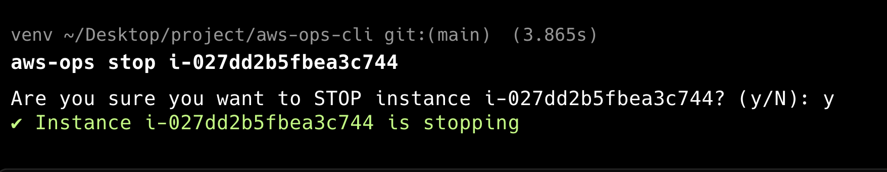

<div align="center">

<!-- Animated Header with Gradient Wave -->


<!-- Animated Title with Glitch Effect -->
<h1>
  
</h1>

<!-- Animated Subtitle with Multiple Lines -->
<p align="center">
  
</p>

<!-- Badges with Animations -->
<p align="center">
  
  
  
  
  
</p>

<!-- Navigation with Styled Links -->
<p align="center">
  <a href="#-features"></a>
  <a href="#-installation"></a>
  <a href="#-usage"></a>
  <a href="#-screenshots"></a>
</p>

<!-- Animated Separator -->


<!-- Stats and Activity -->
<p align="center">
  
  
  
</p>

</div>

<br>

<!-- Colorful Divider -->


<br>

## 🎯 Why AWS Ops CLI?

<div align="center">

<!-- Animated Description -->


<br><br>

<table>
<tr>
<td width="33%" align="center">

<br><br>
<h3>⚡ Lightning Fast</h3>
<p><b>10x Faster</b> than AWS Console<br>Manage EC2 instances in seconds, not minutes.<br>No more console clicking.</p>

</td>
<td width="33%" align="center">

<br><br>
<h3>🛡️ Safe by Default</h3>
<p><b>Zero Accidents</b> guaranteed<br>Built-in confirmations for destructive actions.<br>Multi-account aware.</p>

</td>
<td width="33%" align="center">

<br><br>
<h3>🎨 Beautiful UX</h3>
<p><b>Eye Candy</b> terminal output<br>Color-coded output, clean tables,<br>and intuitive commands.</p>

</td>
</tr>
</table>

</div>

<br>

<!-- Animated Divider -->


<br>

## ✨ Features

<div align="center">

<!-- Feature Heading Animation -->


<br>

<details open>
<summary><b>📋 Core Capabilities</b></summary>

<br>

| Feature                 | Description                                    | Status  | Power Level |
| ----------------------- | ---------------------------------------------- | ------- | ----------- |
| 📊 **List Instances**   | Display all EC2 instances in a beautiful table | ✅ Live | ⭐⭐⭐⭐⭐  |
| ▶️ **Start Instances**  | Boot up instances with a single command        | ✅ Live | ⭐⭐⭐⭐⭐  |
| ⏹️ **Stop Instances**   | Safely stop instances (with confirmation)      | ✅ Live | ⭐⭐⭐⭐⭐  |
| 🔍 **Instance Details** | View comprehensive instance information        | ✅ Live | ⭐⭐⭐⭐⭐  |
| 🌍 **Multi-Region**     | Switch between AWS regions seamlessly          | ✅ Live | ⭐⭐⭐⭐⭐  |
| 👤 **Multi-Profile**    | Support for multiple AWS accounts              | ✅ Live | ⭐⭐⭐⭐⭐  |
| 🎨 **Colored Output**   | Clear state indicators and visual feedback     | ✅ Live | ⭐⭐⭐⭐⭐  |

</details>

<br>

<details>
<summary><b>🔮 Coming Soon (v2.0) - The Future is Bright!</b></summary>

<br>

<table>
<tr>
<td align="center" width="50%">

⏰ **Scheduler**<br>
<sub>Auto start/stop instances on schedule</sub><br>


</td>
<td align="center" width="50%">

💰 **Cost Tracking**<br>
<sub>Monitor EC2 spending in real-time</sub><br>


</td>
</tr>
<tr>
<td align="center" width="50%">

🗄️ **S3 Support**<br>
<sub>Manage S3 buckets from CLI</sub><br>


</td>
<td align="center" width="50%">

🗃️ **RDS Support**<br>
<sub>Control RDS databases</sub><br>


</td>
</tr>
<tr>
<td align="center" width="50%">

📝 **Verbose Logging**<br>
<sub>Detailed operation logs</sub><br>


</td>
<td align="center" width="50%">

📊 **Usage Analytics**<br>
<sub>Track your AWS resource usage</sub><br>


</td>
</tr>
</table>

</details>

</div>

<br>

<!-- Rainbow Divider -->


<br>

## 🛠️ Tech Stack

<div align="center">

<!-- Tech Stack Animation -->


<br>

<!-- Animated Tech Icons -->

<br>


<br>
**Core Dependencies:** `boto3` • `argparse` • `tabulate` • `colorama`
<br>

<!-- Sparkling Divider -->


<br>

## 📥 Installation

<div align="center">

<!-- Installation Animation -->


<br>

</div>

<br>

### Prerequisites

<table>
<tr>
<td width="33%" align="center">
<br>
<sub>Python 3.8 or higher</sub>
</td>
<td width="33%" align="center">
<br>
<sub>AWS credentials configured</sub>
</td>
<td width="33%" align="center">
<br>
<sub>Active AWS account</sub>
</td>
</tr>
</table>

<br>

### Quick Install

<!-- Step by Step with Emojis -->
<table>
<tr><td>

**🔹 Step 1: Clone the Repository**

```bash
git clone https://github.com/itsiiie/aws-ops.git
cd aws-ops
```

</td></tr>
<tr><td>

**🔹 Step 2: Create Virtual Environment**

```bash
python -m venv venv
source venv/bin/activate  # On Windows: venv\Scripts\activate
```

</td></tr>
<tr><td>

**🔹 Step 3: Install the CLI**

```bash
pip install -e .
```

</td></tr>
</table>

<br>

### Configure AWS Credentials

```bash
aws configure
```

<div align="center">

| Required Input        | Example Value   | Description                     |
| --------------------- | --------------- | ------------------------------- |
| AWS Access Key ID     | `AKIAIOSFOD...` | Your AWS access key             |
| AWS Secret Access Key | `wJalrXUtnF...` | Your AWS secret key             |
| Default region        | `ap-south-1`    | Preferred AWS region            |
| Output format         | `json`          | CLI output format (recommended) |

</div>

> 💡 **Pro Tip:** For multiple AWS accounts, use named profiles with `aws configure --profile <name>`

<br>

<!-- Success Animation -->
<div align="center">

<br>
<b>✅ Installation Complete! You're ready to rock! 🎸</b>
</div>

<br>

<!-- Animated Divider -->


<br>

## 🚀 Usage

<div align="center">

<!-- Usage Animation -->


<br><br>


</div>

<br>

### Basic Commands

<table>
<tr>
<td width="50%">

**📋 List all EC2 instances**

```bash
aws-ops list
```

**With specific region:**

```bash
aws-ops --region ap-south-1 list
```

**With AWS profile:**

```bash
aws-ops --profile production list
```

</td>
<td width="50%">

**▶️ Start an instance**

```bash
aws-ops start i-0abc123def456
```

**⏹️ Stop an instance**

```bash
aws-ops stop i-0abc123def456
```

_Includes safety confirmation prompt_

**🔍 Get instance details**

```bash
aws-ops status i-0abc123def456
```

</td>
</tr>
</table>

<br>

### Advanced Examples

<div align="center">

**🌟 Power User Commands 🌟**

</div>

```bash
# Multi-region deployment check
aws-ops --region us-east-1 list
aws-ops --region eu-west-1 list
aws-ops --region ap-south-1 list

# Multi-account management
aws-ops --profile dev start i-dev123
aws-ops --profile staging start i-staging456
aws-ops --profile prod start i-prod789

# Detailed instance inspection
aws-ops --region us-west-2 --profile production status i-0abc123
```

<br>

<!-- Command Cheat Sheet -->
<div align="center">

**📚 Quick Reference Card 📚**

| Command                                  | What it Does                  | Use Case                 |
| ---------------------------------------- | ----------------------------- | ------------------------ |
| `aws-ops list`                           | 📋 Lists all instances        | Daily operations         |
| `aws-ops start <instance-id>`            | ▶️ Starts an instance         | Morning warm-up          |
| `aws-ops stop <instance-id>`             | ⏹️ Stops an instance          | Cost saving              |
| `aws-ops status <instance-id>`           | 🔍 Shows detailed info        | Debugging & monitoring   |
| `aws-ops --region <region> list`         | 🌍 Region-specific list       | Multi-region deployments |
| `aws-ops --profile <profile> start <id>` | 👤 Profile-specific operation | Multi-account management |

</div>

<br>

<!-- Glowing Divider -->


<br>

## 📸 Screenshots

<div align="center">

<!-- Screenshots Animation -->


<br>


</div>

<br>

<!-- Screenshot Showcase -->
<div align="center">

### 📊 Instance List View

_Clean, color-coded table showing all your EC2 instances_

<br>

<kbd>

</kbd>

<br><br><br>

### 🔍 Instance Status

_Comprehensive details about a specific instance_

<br>

<kbd>

</kbd>

<br><br><br>

### ⏹️ Stop Confirmation

_Safety-first: Confirmation prompt for destructive actions_

<br>

<kbd>

</kbd>

</div>

<br>

<!-- Animated Divider -->


<br>

## 🧠 Design Philosophy

<div align="center">

<!-- Philosophy Animation -->


<br><br>


</div>

<br>

<table>
<tr>
<td width="33%" align="center">

### 🛡️ **Safe by Default**

<br>

✅ No bulk destructive operations<br>
✅ Confirmation prompts for critical actions<br>
✅ Clear error messages<br>
✅ Rollback capabilities<br>

<br>


</td>
<td width="33%" align="center">

### 💻 **Developer Experience**

<br>

✅ Intuitive command structure<br>
✅ Consistent output formatting<br>
✅ Helpful error handling<br>
✅ Extensive documentation<br>

<br>


</td>
<td width="33%" align="center">

### 🚀 **Production Ready**

<br>

✅ Multi-account support<br>
✅ Region awareness<br>
✅ Graceful AWS error handling<br>
✅ Battle-tested code<br>

<br>


</td>
</tr>
</table>

<br>

<!-- Sparkle Divider -->


<br>

## 🤝 Contributing

<div align="center">

<!-- Contributing Animation -->


<br><br>


<br><br>

**🎉 Contributions are more than welcome! 🎉**

<br>

<!-- Contributor Steps -->


</div>

<br>

**Quick Contribution Guide:**

1. 🍴 Fork the repository
2. 🌿 Create your feature branch (`git checkout -b feature/AmazingFeature`)
3. 💾 Commit your changes (`git commit -m 'Add some AmazingFeature'`)
4. 📤 Push to the branch (`git push origin feature/AmazingFeature`)
5. 🎁 Open a Pull Request

<br>

<!-- Contributor
